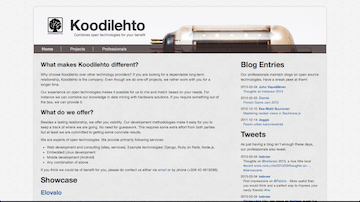

## À Propos

    
    
Mr. Jekyll par <a href="http://www.flickr.com/photos/95492938@N00/3568446372/">Kaptain Kobold</a>  (CC BY-NC-SA)



## Licence



## Démarrage

    
    
Mr. Hyde by <a href="http://www.flickr.com/photos/46952347@N00/919710334/">Luis Carlos Araujo</a>  (CC BY-NC-ND)

Il est vraiment facile de démarrer avec Jekyll une fois que vous êtes parvenus à l'installer. Tout ce que vous devrez faire c'est invoquer la commande `jekyll` et elle vous générera un répertoire  `_site`.

> Je supposerai ici que vous comprenez les basiques de [Git](http://gitscm.org/) et le mode terminal. Si ce n'était pas le cas, je vous recommande d'apprendre au moins les fondamentaux. Ou apprenez simplement les outils au fil de l'eau. À vous de décider.

### Démarrer un Projet

Malheureusement, Jekyll n'est pas livré avec un moyen facile d'initialiser un projet. Et heureusement, c'est facile d'en installer un. Vous pourriez par exemple cloner le repo [jekyll-bootstrap](http://jekyllbootstrap.com/) ou même celui [utilisé par ce site](https://github.com/bebraw/yeswejekyll). Le workflow basique pour initialiser un projet basé sur n'importe quel autre se déroule comme suit : 
    


$ git clone git://github.com/bebraw/yeswejekyll.git <cible>
$ cd <cible>
$ rm -rf .git
$ git init
$ git add .
$ git commit

Allez-y et créez le paramétrage d'un projet sur GitHub

$ git remote add origin <adresse repo>
$ git push origin master


> > Si vous êtes flemmard comme moi, utilisez [hub](http://defunkt.io/hub/). Il s'intègre bien à Git et fournit quelques raccourcis utiles pour GitHub. Vous pouvez cloner un repo en utilisant simplement la syntaxe `git clone username/project` ou créer un nouveau repo avec `git create -d "description"`.

Alternativement, vous pourriez faire un simple `git init` dans un répertoire et démarrer de zéro. De cette manière, vous pouvez construire un projet vraiment facilement en sachant ce que Jekyll attend des projets à structurer.

## Structure du Projet 

Selon la [doc officielle](https://github.com/mojombo/jekyll/wiki/Usage) un projet Jekyll ressemble généralement à cela :

    .
    |-- _config.yml
    |-- _includes
    |-- _layouts
    |   |-- default.html
    |   `-- post.html
    |-- _posts
    |   |-- 2007-10-29-pourquoi-chaque-programmeur-devrait-jouer-nethack.textile
    |   `-- 2009-04-26-barcamp-boston-4-roundup.textile
    |-- _site
    `-- index.html

En outre, c'est toujours une bonne idée que de définir un `.gitignore` contenant le répertoire `_site`. Généralement, c'est quelque chose que vous ne voulez pas versionner.

### \_config.yml

`_config.yml` contient la configuration valable sur tout le site. Il peut s'utiliser aussi pour définir quelques valeurs par défaut que Jekyll utilise durant la génération. Je recommande d'installer au moins ce qui suit pour rester conforme avec les paramétrages de GitHub. Il existe aussi [bien d'autres options de configuration](http://jekyllrb.com/docs/configuration/) que vous pourriez étudier.

Parmi toutes les options, j'aimerais m'attarder sur `exclude`. Comme vous pourriez le deviner, elle vous permet d'exclure les fichiers et répertoires de votre construction Jekyll. Examinez ce répertoire `_site` généré vous donnera une meilleure idée de ce qui est inclus à l'intérieur et de ce qui ne l'est pas.


safe: true
pygments: true


<!--
Ce réglage fait fonctionner la commande par défaut `jekyll` pour lancer un serveur de développement qui génère le site web au fur et à mesure que vous enrichissez les fichiers. En pratique c'est très utile. Vous pourriez vouloir bricoler le marqueur `pygments` en fonction de vos besoins.
-->

> Je recommande vivement d'installer [LiveReload](http://livereload.com/) ou un outil équivalent pour éliminer le besoin de rafraîchir manuellement le navigateur durant le développement.

Une propriété intéressante de `_config` est le fait que vous pouvez faire référence à ses items dans les templates. Vous pouvez faire référence à ces items en utilisant une syntaxe de type  `{{ site.property }}`. Je reviendrai là-dessus dans la section suivante.

### \_layouts

Comme son nom peut vous laisser aisément le deviner, `_layouts` contient les fichiers de mise en page du projet. Ces layouts forment l'architecture de votre projet. Vous définirez au moins un template par défaut et peut-être selon vos besoins deux templates auxiliaires.

Si vous vous sentez vraiment paresseux et en panne d'imagination, prenez simplement un [template Boilerplate HTML5](http://html5boilerplate.com/) et construisez dessus votre mise en page. Souvenez-vous néanmoins d'une chose très importante. Incluez un marqueur `{{ content }}` à l'endroit où vous voudrez injecter le véritable contenu de la page.

Comme cela était précisé dans la section précédente, vous pouvez utiliser une syntaxe de type `{{ site.property }}` pour faire référence aux propriétés globales définies dans `_config.yml`. La même syntaxe peut aussi être utilisée pour faire référence à des propriétés spécifiques de pages définies sur le Front Matter YAML. Dans ce cas, utilisez simplement la syntaxe suivante : `{{ page.property }}`

Si vous êtes curieux sur ce que vous pouvez faire en plus, explorez la documentation de [Liquid](http://liquidmarkup.org/), le moteur de template utilisé par Jekyll. Jekyll fournit aussi [plusieurs extensions](https://github.com/mojombo/jekyll/wiki/Liquid-Extensions) qui vous permettent d'exécuter différentes opérations. En fait, nous en couvrirons une d'entre elles dans la section suivante.

### \_includes

Le répertoire `_includes` contiendra la data que vous pourrez inclure dans les pages de votre projet en utilisant la syntaxe spécifique :
    
    

Comme vous pouvez le remarquer, j'ai décidé d'utiliser une extension `md` dans mon include. Ceci veut dire que j'utilise la [syntaxe Markdown](http://daringfireball.net/projects/markdown/syntax) dans ce fichier particulier.

En plus du HTML et de Markdown, Jekyll supporte aussi [Textile](http://redcloth.org/textile). J'opterai plutôt pour le Markdown parce qu'il est utilisé à la fois sur GitHub et Stack Overflow. Et une fois la syntaxe prise en main, elle s'avère vraiment élégante.

### index.html

Comme je le précisais pluts haut, Jekyll infère le format utilisé basé sur l'extension. Ainsi, plutôt que d'avoir un `index.html`, il est possible d'écrire l'index en Markdown.

Quel que soit votre choix, il y a une chose que vous devez absolument faire. Vous devez définir quelque chose connu ici comme le [YAML Front Matter](http://jekyllrb.com/docs/frontmatter/). Vraiment très important vous savez !

Dans le cas de cette page particulière, le "Front-Matter" ressemble à cela : 
    
    ---
    layout: default
    title: À Propos
    css: index
    js: index
    ---
    

Comme discuté plus tôt, il est possible de faire référence à ces propriétés de mise en page définies ici. Dans ce cas, j'injecte ici de l'information concernant le titre de la page ainsi que les fichiers CSS et Javascript personnalisés et utilisés ici. C'est plus qu'une convention personnelle. Dans le cas où `css` ou `js` n'est pas fourni, je ne restituerai pas la référence au script dans ma mise en page.

Il est facile de parvenir à cela en utilisant une balise `if` comme suit : 
    
    <link rel="stylesheet" href="/css/{{ page.css }}.css" type="text/css" />

Parfois, vous pouvez avoir envie de créer un site hiérarchique (par ex. /foobar). Traditionnellement les clients comme ceux-ci sont créés avec leur propre structure de répertoire et les fichiers index.html. Heureusement Jekyll fournit un raccourci pratique que nous pouvons utiliser. Dans ce cas nous devrions créer simplement `foobar.html` à la racine du projet et produire son point de propriété `permalink` sur `foobar/` (permalink: foobar/).

### \_posts

Jekyll fournit quelques utilitaires qui facilitent la maintenance d'un blog. `_posts`, comme vous pourriez le deviner, contiendra vos posts de blog. Il utilise une forme spécifique de schéma de nommage. Plutôt que de produire ces fichiers à la main, je recommande d'utiliser [jekyll-bootstrap Rakefile](https://github.com/plusjade/jekyll-bootstrap/blob/master/Rakefile). Copiez simplement ça à la racine de votre projet et examinez-le.

Afin de générer un post de blog, créez d'abord un répertoire `_posts` et après cela lancez simplement `rake post title="Premier Post"`. Vous pouvez en outre passer des paramètres de date et des tags.

Examinez le fichier généré et remplissez les détails. Par défaut, il semble pointer sur un layout `post` et contiendra un include bonus. Vous pouvez réparer ces problèmes en bricolant un peu le Rakefile.

Maintenant que vous avons notre post, comme pouvons-nous y faire référence ? Au cas où vous n'avez pas installé une catégorie pour le post, vous pouvez utiliser le schéma URL par défaut. Naviguez jusqu'à /annee/mois/jour/premier-post.html pour voir votre post. Ça y est : vous êtes désormais un blogueur officiel !

Oui, ce n'est pas encore très élégant mais cela compte encore. Au cas où vous ne seriez pas satisfait du schéma d'URL, vous pouvez le modifier en utilisant la [configuration du permalien](http://jekyllrb.com/docs/permalinks/). Par défaut sur `date`, mais vous pouvez alternativement utiliser soit `pretty` (cache le .html) ou `none` si vous vous sentez de ne pas afficher de date.

Avoir accès aux posts de cette manière n'est pas vraiment utile. Ce serait pratique de pouvoir afficher quelque part tous les posts existants. Nous pouvons taper dans le système de template Liquid comme ça par exemple : 

    
    
        <h2>
            <a href="{{ site.prefix }}{{ post.url }}">{{ post.title }}</a>
        </h2>
        {{ post.date | date_to_string }}
        {{ post.content }}
        

    
    

Parce que ceci ne pourrait pas être suffisant, nous pouvons aussi taper dans la [pagination](http://jekyllrb.com/docs/pagination/).

Si nous voulons présenter une archive de blog, nous pouvons faire quelque chose avec ça : 

    
    <ul>
    
        <li>
            
{{ post.date | date_to_string }}

            <a href="{{ site.prefix  }}{{ post.url }}">{{ post.title }}</a>
        </li>
    
    </ul>
    

Parfois, vous pourriez avoir été un blogueur actif et disposer pour une raison ou une autre de  contenus à migrer vers Jekyll. Il existe [divers scripts de migration](http://import.jekyllrb.com/docs/home/) disponibles qui aident à cette tâche particulière.

Pour que ce soit plus facile pour vos lecteurs de consommer votre blog, vous pourriez fournir un fil de syndication. J'ai installé un [exemple d'Atom](https://github.com/bebraw/geekcollision-site/blob/master/atom.xml).

Et si vous voulez simplement bloguer et ne pas vous soucier des détails techniques, jetez un oeil à [Octopress](http://octopress.org/), un framework de blogging construit sur Jekyll. Il prend soin du boilerplate exigé. Après ça vous n'avez plus qu'à vous soucier du contenu (la partie facile).

### \_site

Ce répertoire contient la production Jekyll. Généralement, vous l'exclurez de votre contrôle de version. Dans le cas de Git, incluez-le simplement dans votre [.gitignore](https://www.kernel.org/pub/software/scm/git/docs/gitignore.html).

Au cas où vous voudriez mieux comprendre comment fonctionne Jekyll, regardez avec soin la production.

## Hébergement

Héberger des sites Jekyll est vraiment facile. Presque tout ce que vous avez besoin de faire est de recevoir vos data du répertoire  `_site` puis de les mettre à disposition sur l'un de vos serveurs. Comme cela a été suggéré plus tôt dans l'introduction, [GitHub Pages](https://pages.github.com) fournit un support natif pour ça. Même si c'est aussi une option, dans le cas où vous ne disposeriez pas de serveur disponible.

Il y a des limites car vous ne pouvez pas utiliser par défaut les plugins Jekyll [sans quelques petits hacks](http://charliepark.org/jekyll-with-plugins/). Dans ce cas, vous hébergez simplement les fichiers générés sur GitHub plutôt que de de laisser Jekyll vous produire la compilation.

Si vous êtes satisfait du workflow par défaut, je recommande d'installer un petit script pour vous aider à faire ça. GitHub attend que votre site existe dans la branche `gh-pages`. Si vous avez déjà joué avec les branches dans Git, vous savez que c'est très facile à régler. J'aime répliquer ma branche `master` vers `gh-pages`. La commande basique pour faire ça est `git push origin master:gh-pages`. Si la branche n'existe pas encore, il vous la créera.

Je maintiens généralement un petit script utilitaire comme ceci dans mes repositories à exécuter pour pousser la data : 


#!/bin/bash
cd "$(dirname "$0")"
git push
git push origin master:gh-pages
git push --tags


Ce morceau de `cd` dans ce cas s'assure simplement que j'exécute les commandes dans le bon répertoire et vous pourriez ne pas en avoir besoin.

En dehors de GitHub, il peut être intéressant d'héberger votre site sur [Heroku](http://www.garron.me/blog/deploy-host-jekyll-static-site-free-heroku.html) ou [Amazon S3](http://vvv.tobiassjosten.net/development/jekyll-blog-on-amazon-s3-and-cloudfront/). Ou vous pourriez installer un serveur proxy local qui pointe vers GitHub ou n'importe lequel de ces services. Oh les possibilités : vous pouvez transformer un simple problème d'hébergement en un problème complexe si vous voulez vraiment simplement prendre une direction comme celle que devrait produire tout bon ingénieur.

## Étude de Cas - Le site Koodilehto

[Koodilehto](http://koodilehto.fi/) est une co-opérative IT basée à Jyväskylä. C'est un site que j'ai construit moi-même même si d'autres ont contribué sur quelques morceaux et bien sûr aux feedbacks. Un feedback supplémentaire a été obtenu via [criticue](http://criticue.com/) et [Feedback Roulette](http://feedbackroulette.com/). Ceci a aidé à raffiner l'aspect visuel du site.

En plus de Jekyll le site utilise [Bootstrap](http://twitter.github.com/bootstrap/) pour la mise en forme et quelques morceaux de JavaScript pour certaines portions plus interactives du site. Celles-ci comprennent RSS et des widgets Twitter, et l'affichage logique de la page "professionals".

[RequireJS](http://requirejs.org/) is used for managing the JavaScript. At the moment no optimized build is used although that would likely be a nice optimization. The site seems quite fast enough even without this.

Even though the site is not that large it still highlights some problems of Jekyll you should be aware of. For instance building the navigation tree was not entirely trivial and took some nasty conditional logic. I believe it is possible to work around this issue by using some suitable plugin, though. In that case you cannot use GitHub hosting "as is".

In case you want to see how the site has evolved, study [the article on its history](http://koodilehto.fi/projects/koodilehto/) and the [source tree](https://github.com/koodilehto/koodilehto-site).

## Forces et Faiblesses de Jekyll

Pour certains types de projets une combinaison de Jekyll et de Pages GitHub pour l'hébergement est simplement génial. Si vous avez besoin d'interactivité, vous ajouterez probablement un peu de JavaScript. Les blogs, comme discutés précédemement, sont particulièrement adaptés à Jekyll. La même chose est valable pour les sites simples tels que Koodilehto que nous avons brièvement parcouru.

### Jekyll vs. WordPress

Comparé à une plateforme de blogging bourrée de fonctionnalités comme [WordPress](http://wordpress.com/), Jekyll dispose de certains avantages élégants. Cette combinaison dispose d'un workflow de développeur compatible avec Git. En outre, elle est plus sûre par défaut, parce que la surface d'attaque est plus petite. Vous ne devrez en aucun cas vous soucier de mettre à jour votre serveur. Dans ce cas nous outsourçons ceci aux types de GitHub. C'est aussi très facile d'héberger un site statique. Vous pouvez le mettre littéralement n'importe où avec une configuration minimale.

À certains égards, WordPress peut être un choix supérieur. Il est définitivement plus facile pour un utilisateur moins technique. Et il y a une énorme communauté autour. Vous êtes sûr de trouver plein de plugins cools pour améliorer votre expérience WordPress. Mais, comme je l'ai dit, avec la puissance vient une responsabilité géante. Celle de la sécurité dans ce cas.

### Faiblesses

Le design de Jekyll commence par briser certains scénarios. Comme je le précisais au-dessus construire une architecture d'information complexe peut devenir vraiment difficile. Les schémas de marquage qu'il supporte ne sont pas toujours adéquats.

C'est sûrement élégant par exemple d'utiliser le Markdown pour le contenu et le HTML pour la mise en forme. Le truc est que parfois vous voudriez joindre quelques classificateurs à votre contenu. Ce type de travail est commun quand vous voulez installer quelques hooks à votre code Javascript. L'architecture actuelle de Jekyll vous oblige à utiliser du HTML dans ce cas.

Les plugins peuvent soulager un peu ce problème en vous permettant d'inclure du Markdown dans un document HTML. Mais ce n'est pas possible par défaut. Il est possible d'utiliser du HTML dans les documents Markdown mais une fois de plus, il n'est pas possible d'utiliser du Markdown dans le HTML. Ce peut être un vrai problème.

Je sais que ceci doit être juste quelques cas pointus que j'ai rencontrés. Ceci dit, si vous voulez faire quelque chose de plus complexe qu'un simple site ou blog, envisagez des alternative ou un Jekyll renforcé d'une collection de plugins.

## From Meek to Neat

Si vous avez suivi ce document jusque là vous avez probablement assemblé des choses. C'est probablement très laid mais fonctionnel. Maintenant il est temps de transformer votre site en chef d'oeuvre ou au moins ranger un peu le bazar.

### Developing Foundation

La [Fondation Zurb](http://foundation.zurb.com/) est une alternative à l'énorme framework [Twitter Bootstrap](http://twitter.github.com/bootstrap/). Parce que j'ai toujours préféré parier sur l'outsider, je vais vous présenter comment intégrer Foundation à votre projet et m'assurer qu'il a bien été construit sur une fondation solide. (héhé).

Téléchargez la version vanilla de Foundation sur leur site et décompressez-la quelque part. Vous devriez trouver dedans deux répertoires, `css` et `js`. Copiez-les sur votre projet.

> Si vous vous sentez sémillant, essayez et ouvrez ce fichier `index.html` inclus dans le package Foundation. Vous devriez pouvoir visualiser quelques démos vraiment basiques et vous faire une idée du marquage utilisé.

Parce que c'est plus facile de copier et coller que de démarrer de zéro, choisissez une [mise en forme pré-construite](http://foundation.zurb.com/templates.php). J'aime le look du Blog, aussi je choisirai celle-la. Allez-y et prenez celle qui vous plaît.

Une fois terminée l'opération laborieuse, mettez-vous sur mon dos. Allez-y : avant de migrer souvenez-vous d'inclure ce tag {{ content }} quelque part sur la page. Une chose de plus. Souvenez-vous d'ajoutez ce qui suit dans votre `head` (pas votre vrai tête de préférence) : 
    

<link rel="stylesheet" href="css/normalize.css">
<link rel="stylesheet" href="css/foundation.css">


Ce bit `normalize` est ici pour éliminer quelques différences de navigateurs. Par défaut ils tendent à avoir les réglages les plus étranges aussi il est préférable de les éliminer une fois pour toutes. Soyons tous normaux, non ? La dernière ligne devrait être évidente à cette heure. Il existe aussi une version minifiée. Elle a été appelée aptly as `foundation.min.css`. How come the name is longer then? I guess I will never know.

Il est fort possible que votre site ait encore besoin d'un peu de bricolage. Après tout vous ne souhaitez pas finir à souffrir du syndrome Bootstpa bien que cela devrait être techniquement impossible parce que nous utilisons ici Foundation. Votre étape suivante sera de consulter la [Documentation Foundation](http://foundation.zurb.com/docs/).

### Choisir un Schéma de Couleur

Le design de couleur est une partie vraiment délicate. Vu que je suis une personne ennuyeuse j'ai décider d'un schéma en gris puis construire des texture là-dessus. Vous pourriez utiliser un outil comme [Color Scheme Designer](http://colorschemedesigner.com/) pour imaginer le type de schéma à utiliser. Vous trouverez probablement utile d'utiliser  [HTML_CodeSniffer](http://squizlabs.github.com/HTML_CodeSniffer/) pour vérifier quelques ratios de contraste.

Il existe aussi une multitude d'[autres outils](http://webdesignledger.com/tools/10-super-useful-tools-for-choosing-the-right-color-palette) disponibles. Je n'utilise pas beaucoup ces outils mais préfère personnellement tripoter l'Inspecteur Chrome jusqu'à ce que ce soit acceptable. J'essaye aussi d'éviter les couleurs brillantes et pense en termes de hiérarchie visuelle. Les couleurs peuvent vous aider à définir ce qui est important et ce qui ne l'est pas. De cette manière, elles guident la manière dont les utilisateurs perçoivent le site et l'utilisent pour finir.

Si vous ne trouvez rien qui fonctionne vraiment bien, essayez de vous accrocher à un vrai blanc (peut-être descendu d'un ton) et quelques couleurs plus sombres pour le compléter. Généralement, c'est une bonne idée d'éviter les abslus et de les descendre un peu. Plutôt que d'avoir un #000 (noir) essayez #111 ou #222 pour voir quel type de différence cela produit visuellement. Ce n'est pas beaucoup mais c'est encore quelque chose et une de ces choses qui rendent votre design différent. Une fois que vous avez fini avec ces petites choses, cela commence à compter.

Parce que les grandes aires de couleurs pures peuvent paraître un peu distrayantes, même si c'est plus une question de goût, je tends à utiliser des textures subtiles pour me débarrasser de ce problème. Il est très utile de décider d'un schéma de couleur avant de migrer sur la texture. Les couleurs fonctionnent comme une base de votre design et les textures lui donneront le peps dont il a besoin.

### Designer une Hiérarchie Visuelle

Je pense que c'est un de ces trucs de design qui est souvent négligé. Il est très important d'avoir une bonne idée de ce qui est important sur une page et ce qui ne l'est pas. Ceci vous permet de prendre quelques décisions claires. Par exemple, dans ce guide, j'ai décidé que la table des matières ne devraient pas exiger trop d'attention. J'ai décidé par conséquent de lui ajouter un peu d'opacité. Survolez-la avec votre curseur pour voir ce que je jeux dire.

Les titres , sélection de fontes, textures, détails subtils et même le positonnement sont des parties importantes d'une hiérarchie visuelle. Ces outils vous permettent de guider l'attentionde votre lecteur. Parfois, vous pourriez même vouloir être un peu *audacieux* dans vos décisions. Tout les reste vous appartient.

### Choisir des Textures Subtiles

Je suppose que c'est l'un des trucs qui divise les gens. Certains aiment utiliser des textures plus grunge. Généralement je m'attache à quelque chose de subtil. Je suis certain que vous pouvez parvenir à un bon design de nombreuses façons. Dans ce cas je vous montrerai comment compléter votre design avec [Subtle Patterns](http://subtlepatterns.com/).

`Subtle Patterns` is a collection of, well, subtle patterns. In effect these are very light yet still noticeable textures that are tileable. This makes them excellent for background usage.

Vu que je suis un type Chrome, j'aime utiliser [l'extension Subtle Patterns de Chrome](https://github.com/overra/Subtle-Patterns-Chrome-Extension) pour essayer les textures. Ceci fournit un moyen élégant et amusant de naviguer dans leurs sélections. Après ça, vous devez juste extraire l'URL en utilisant l'Inspecteur, télécharger l'image et la joindre à votre projet.

> Si vous voulez voir quelle différence cela produit, <a href="#" class="togglePatterns">vous pouvez faire jongler les patterns sur cette page</a>.

### Choisir des Photos et de l'Imagerie

Une autre chose qui peut faire la différence, c'est l'usage d'images de photothèques.  Si vous voulez faire l'idiot, vous pourriez essayer quelque chose comme [lorempixel](http://lorempixel.com/) ou [placekitten](http://placekitten.com/). Cela vous donne un peu de syntaxe élégante que vous pouvez utiliser pour générer des images sur votre site. Particulièrement utile en phase de prototypage.

Une fois que les choses deviennent plus sérieuses, vous voudrez probablement migrer sur autre chose et choisir une image basée sur le contexte. Pour ça, j'aime [compfight](http://compfight.com/). Il utilise Flickr comme backend mais fournit une interface plus saine  que Flickr.

Tout ce que vous devez faire, c'est vous assurer que l'image est en `Creative Commons` et l'attribuer proprement à son auteur. Parfois la licence pourrait être restreinte sur l'usage commercial, aussi conservez-ça en tête au moment de chercher des photos. Il y a des fois où vous trouverez de belles photos qui ont été licenciées ainsi. Il peut être très possible de négocier un montant de licence avec l'auteur. Parfois il vous donnera une permission pour de la visibilité.

Bien sûr, le cas idéal est que vous disposiez de vos propres images ou que vous connaissiez quelques photographes. Il existe beaucoup de photothèques si vous ne savez pas où chercher.

### Ajouter des Détails Subtils

S'il y a une chose de plus que vous pouvez faire, c'est de travailler ce layer subtil. Vous pourriez par exemple ajouter à certains endroits le trucs des [coins arrondis](http://www.css3.info/preview/rounded-border/). Ou vous pourriez essayer d'ajouter un peu de [box shadow](http://css3gen.com/box-shadow/) aux endroits appropriés.

Vous pourriez aussi expérimenter quelques styles de bordures.  Parfois tout ce que cela demande c'est une bordure au bon endroit pour rendre un design plus intéressant.

### Choisir des Fontes

Parce que je ne suis vraiment pas un expert en typographie et que je peux juste distinguer les fontes 'serif' des 'sans-serif' et je sais que ces deux-là n'ont rien à voir avec les sheriffs je m'attaque généralement à utiliser seulement deux fontes dans mon design. L'une sera utilisée pour les titres alors que l'autre sera utilisée pour le reste du site. Dans ce cas, [accorder les fontes](http://webdesign.tutsplus.com/articles/typography-articles/a-beginners-guide-to-pairing-fonts/) est essentiel. Pour avoir une meilleure idée, regardez ces combos existants](http://designshack.net/articles/css/10-great-google-font-combinations-you-can-copy/).

Si vous savez ce que vous faites, utiliser plus de deux fontes pourra convenir. Si vous ne savez pas encore faire la différence en une `font`e et un `typeface` I would not bother. Et si vous ne savez pas ce qu'est un `kerning`, il y a même un [jeu pour ça](http://type.method.ac/).

> Pour vous faciliter la recherche de bonne fontes, il existe une belle [extension Chrome](https://chrome.google.com/webstore/detail/google-font-previewer-for/engndlnldodigdjamndkplafgmkkencc?hl=en) pour ça. Utilisez-la.

Dans le cas où vous voudriez en savoir plus sur les [Fontes Web de Google](http://www.google.com/webfonts) je suggère d'étudier leur [tutoriel](https://developers.google.com/webfonts/docs/getting_started) sur le sujet. S'il y a une chose que je dois vraiment clarifier, c'est le fait que vous devez absolumement régler la propriété `font-weight` pour que l'output soit le même sur tous les navigateurs. Si vous oubliez ça, vous pourriez vous retrouver avec quelque chose d'étrange dans tout autre navigateur que celui que vous utilisez en ce moment.

### Tester Votre Design

Comment savoir si vous êtes parvenus à un bon design ? Les chances sont fortes que vous n'y êtes pas. Même les designers expérimentés sont aveugles à un certain stade de leurs leurs fautes. Comme nous l'avons vu dans le cas du site Koodilehto, cela peut prendre quelques itérations pour parvenir à quelque chose qui ne semble pas complètement pourri. Et même si le site s'affiche bien, il peut être encore sans utilité si le contenu n'est pas dessus.

Comme suggéré dans l'étude de cas, il existe des services comme [criticue](http://criticue.com/) et [Feedback Roulette](http://feedbackroulette.com/) qui peuvent être utiles. Bien sûr, dans un monde idéel, nous pourrez tester votre design avec votre groupe cible plutôt que des personnes au hasard. En fait, savoir pour qui vous designez peut ouvrir quelques noeuds et aider sur la partie contenu. Il est beaucoup plus facile de designer quand vous savez à qui ça s'adresse.

Au cas où votre site a suffisamment de trafic, vous pourriez envisager le test AB. En fait, le test AB répond à une question simple : ceci ou cela ? Il existe des services comme [Optimizely](https://www.optimizely.com/) qui fournissent une interface facile à utiliser pour designer ces types de tests et en tirer des métriques utiles. Si vous êtes une personne plus orientée code, vous pourriez trouver utile quelque chose comme [ABalytics](https://github.com/danmaz74/ABalytics). Il s'intègre bien avec [Google Analytics](http://www.google.com/analytics/) afin que vous puissiez voir là-bas les résultats de vos variantes de test.

Je recommande chaudement de tester votre design. Avoir simplement quelque chose qui semble bien n'est souvent pas suffisant. Vous aurez besoin de data pour confirmer vos intuitions. C'est là où des concepts comme le test AB ou les web analytics sont vraiment commodes.

#### Régler les Analytics

Faire fonctionner [Google Analytics](http://www.google.com/analytics/) sur votre projet est vraiment simple. Vous avez juste besoin d'inclure le fragment de code sur votre template par défaut et c'est fini. Je l'ai activé de cette façon dans ce projet, afin que vous n'ayez qu'à régler son identifiant sur _config.yml` pour le faire fonctionner.

Aussi, dans le cas où vous utilisez ce projet comme votre template, faites cela et vous aurez des analytics sur votre site.

### Coloration Syntaxique avec Pygments

One of the coolest features of Jekyll for me is the fact that it supports [Pygments](http://pygments.org/). It is a Python based code highlighter. I have used it in this little guide even. You will need to complement its output using some [pygments-css](https://github.com/richleland/pygments-css). In this case I have stuck with `github.css` as it seems to fit the overall theme and it is hard to go wrong with that.

The basic syntax of it is very simple. You simply use {{ " and {{ " tags and stash the content to be highlighted between those two. You may even enable line numbers like this: {{ ".

### Ressources Supplémentaires

Internet est bourré de ressources élégantes en design . J'ai essayé d'en lister quelques-unes en-dessous : 

* [Apprendre les mises en pages CSS](http://fr.learnlayout.com/no-layout.html) - Particulièrement adaptée aux débutants. Quelques jolis trucs aussi pour les pros.
* [Responsive Design Bookmarklet](http://responsive.victorcoulon.fr/)
* [Design Course for Hackers](http://hackdesign.org/) - Si vous provenez d'un cursus de programmation, regardez ça.
* [Method of Action](http://method.ac/) - Design pour les esprits analytiques.

## Conclusion

Jekyll fournit un moyen simple de développer des sites web. Il pourrait ne pas être parfait mais combiné avec des possibilités d'hébergement que nous avons évoquées, c'est un moyen très accessible pour les construire. J'espère que vous aurez pioché quelques trucs généraux de ce guide. En dehors de la plate-forme, le design web est toujours difficile et a ses propres contraintes.

Si vous pressentez qu'il manque quelque chose ou si vous avez découvert un bug, faites-le moi savoir sur le "[issue tracker](https://github.com/bebraw/yeswejekyll/issues)". Si vous avez trouvé ce guide utile, j'apprécierais un tweet ou même une petit donation pour mon temps. Vous pourrez trouver les boutons au-dessus de la table des matières. Merci !
